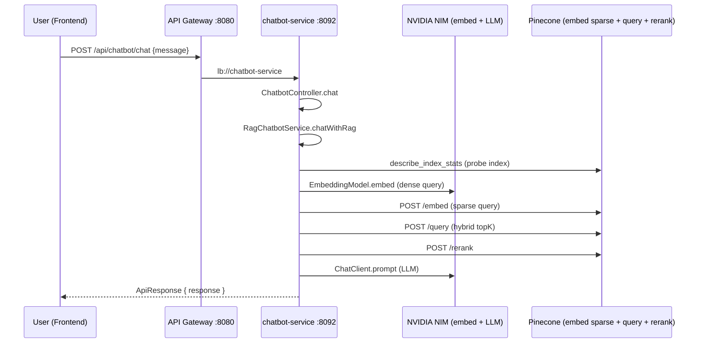

# Artifact: Luồng Chatbot RAG (Data Flow + mapping mã nguồn)

Tài liệu này là **bản tra cứu nhanh** khi bảo vệ đồ án: mỗi bước luồng dữ liệu tương ứng **file nào**, **class/hàm nào**, và **làm gì**.  
Cập nhật theo mã nguồn trong repo `electro-store-microservices` (chatbot-service + frontend + gateway).

---

## 1) Tài liệu / nguồn tham chiếu (References)

### A. Tài liệu bên ngoài (lý thuyết hybrid RAG)

| Nội dung | URL |
|----------|-----|
| Pinecone — Hybrid search (vector API, alpha, `hybrid_score_norm`, dotproduct) | https://docs.pinecone.io/guides/search/hybrid-search |
| Pinecone — Model `llama-text-embed-v2` (dense trong ví dụ docs) | https://docs.pinecone.io/models/llama-text-embed-v2 |
| Pinecone — Inference API (embed / rerank) | https://docs.pinecone.io/reference/api/2025-04/inference/generate-embeddings |

### B. Tài liệu trong repo (implementation thực tế)

| Nội dung | Đường dẫn |
|----------|-----------|
| Cấu hình Spring AI + Pinecone + RAG | `chatbot-service/src/main/resources/application.yml` |
| Thuộc tính RAG (topK, alpha, rerank, ingest) | `chatbot-service/src/main/java/com/electro/chatbot/config/RagProperties.java` |
| Pinecone hybrid (dự án) | `docs/CHATBOT_PINECONE.md` |
| **Kịch bản bảo vệ** (bài toán → kỹ thuật → trích dòng code) | `docs/CHATBOT_BAO_VE_TRINH_BAY.md` |

---

## 2) Luồng Chat (runtime) — từ người dùng đến câu trả lời

### Bảng mapping — Chat

| Bước | File | Thành phần | Việc làm |
|------|------|--------------|-----------|
| 1. Gọi API | `frontend/src/services/chatbotService.js` | `CHATBOT_BASE`, `sendChatMessageStream` | `POST` tới Gateway (`VITE_API_URL` / override). Giả lập “streaming” bằng cách tách từng từ sau khi nhận full JSON. |
| 2. UI gọi service | `frontend/src/components/Chatbot/StoreChatbot.jsx` | `sendQuestion`, `sendChatMessageStream` | Gắn UI, session, history client. |
| 3. Route Gateway | `api-gateway/src/main/resources/application.yml` | route `chatbot-service` | `Path=/api/chatbot/**` → `lb://chatbot-service`. |
| 4. JWT public paths | `api-gateway/src/main/java/com/electro/gateway/filter/JwtAuthenticationGlobalFilter.java` | `PUBLIC_PATHS` | Cho phép không JWT: `/api/chatbot/chat`, `/api/chatbot/rag-status`. |
| 5. Nhận HTTP | `chatbot-service/.../controller/ChatbotController.java` | `chat()` | Validate message, gọi `ragChatbotService.chatWithRag`. |
| 6. Điều phối RAG | `chatbot-service/.../service/RagChatbotService.java` | `chatWithRag` | Kiểm tra index trống; `retrieve`; ghép context; system prompt guardrail; gọi `ChatClient` (LLM). |
| 7. Probe index | `chatbot-service/.../service/RagRetrievalService.java` | `isIndexEmpty()` | `pineconeRagClient.getNamespaceVectorCount()` — `describe_index_stats`. |
| 8. Retrieval | `chatbot-service/.../service/RagRetrievalService.java` | `retrieve`, `hybridRetrieve`, `denseRetrieve`, `rerank` | Hybrid: dense (Spring `EmbeddingModel`) + sparse (`embedSparse`) + scale α (`HybridScoreNormalizer`) + `queryHybrid`; rerank qua Pinecone API. |
| 9. Scale α | `chatbot-service/.../pinecone/HybridScoreNormalizer.java` | `l2Normalize`, `scaleDense`, `scaleSparse` | Chuẩn hóa dense; nhân α / (1−α) theo pattern Pinecone. |
| 10. HTTP Pinecone | `chatbot-service/.../pinecone/PineconeRagClient.java` | `embedSparse`, `queryHybrid`, `upsertHybrid`, `rerank`, `getNamespaceVectorCount` | Gọi `api.pinecone.io/embed`, data-plane `/query`, `/vectors/upsert`, `api.pinecone.io/rerank`, `/describe_index_stats`. |
| 11. Security service | `chatbot-service/.../config/SecurityConfig.java` | `filterChain` | `permitAll` cho `/api/chatbot/chat`, `/api/chatbot/rag-status`; `ingest` cần authenticated. |
| 12. Cấu hình model | `chatbot-service/src/main/resources/application.yml` | `spring.ai.openai` | Base URL NVIDIA, model chat + embedding; Pinecone vectorstore key/index. |

---

## 3) Luồng Ingest (đồng bộ catalog → Pinecone)

### Bảng mapping — Ingest

| Bước | File | Thành phần | Việc làm |
|------|------|--------------|-----------|
| 1. Nạp mồi khi start | `chatbot-service/.../config/StartupIngestionConfig.java` | `CommandLineRunner.run` | Thread nền, sleep ~35s, gọi `ingestAllProducts()`. |
| 2. Lịch định kỳ | `chatbot-service/.../service/ProductIngestionService.java` | `@Scheduled ingestAllProducts` | Cron `0 0 2 * * ?` (2h sáng). |
| 3. Trigger thủ công | `chatbot-service/.../controller/ChatbotController.java` | `triggerIngestion` | `POST /api/chatbot/ingest`, `CompletableFuture`, cờ `ingestRunning`. |
| 4. Lấy sản phẩm | `ProductIngestionService` + Feign | `catalogClient.getAllProducts` | Phân trang catalog-service. |
| 5. Build text + meta | `ProductIngestionService` | `buildAggregatedProductContent`, metadata | Tạo nội dung RAG + metadata (`name`, `price`, …). |
| 6. Chunk | `ProductIngestionService` | `TokenTextSplitter`, `assignChunkIds` | Chunk + id dạng `product-{id}-c{n}`. |
| 7. Upsert hybrid | `RagRetrievalService` | `upsertHybridChunks` | Dense embed (NVIDIA) + sparse embed (`passage`) + `upsertHybrid`. |
| 8. Trạng thái | `ChatbotController` | `ragStatus` | `indexEmpty`, `ingestRunning`, hint (cho script/monitor). |

---

## 4) Gợi ý cách trình bày trước hội đồng (1 đoạn “giọng văn”)

Hệ thống triển khai **RAG hai tầng retrieval**: tầng đầu là **hybrid search trên Pinecone** kết hợp **embedding dense** (ngữ nghĩa, NVIDIA) và **embedding sparse** (từ vựng, Pinecone), có **trọng số α** ở thời điểm truy vấn để cân bằng hai tín hiệu theo khuyến nghị tài liệu Pinecone; tầng hai là **rerank** để chọn lại các đoạn văn bản ứng viên trước khi đưa vào **LLM** sinh câu trả lời. Luồng triển khai được cụ thể hóa trong `RagRetrievalService` và `PineconeRagClient`, trong khi `RagChatbotService` đảm nhiệm **guardrail** (chỉ trả lời theo context và danh sách sản phẩm được phép). Tham chiếu lý thuyết hybrid: [Pinecone Hybrid search](https://docs.pinecone.io/guides/search/hybrid-search).

---

## 5) Ghi chú vận hành

- **Reingest / tạo index**: script `scripts/Reingest-Chatbot.ps1`, `scripts/Setup-PineconeHybridIndex.ps1` (chạy từ thư mục gốc repo, không phải `frontend/`).
- **Gateway vs trực tiếp**: frontend mặc định gọi Gateway `:8080`; `chatbot-service` vẫn lắng nghe `:8092` sau khi route.

---

*Tạo tự động để phục vụ bảo vệ đồ án — có thể chỉnh sửa trực tiếp file này nếu pipeline thay đổi.*
