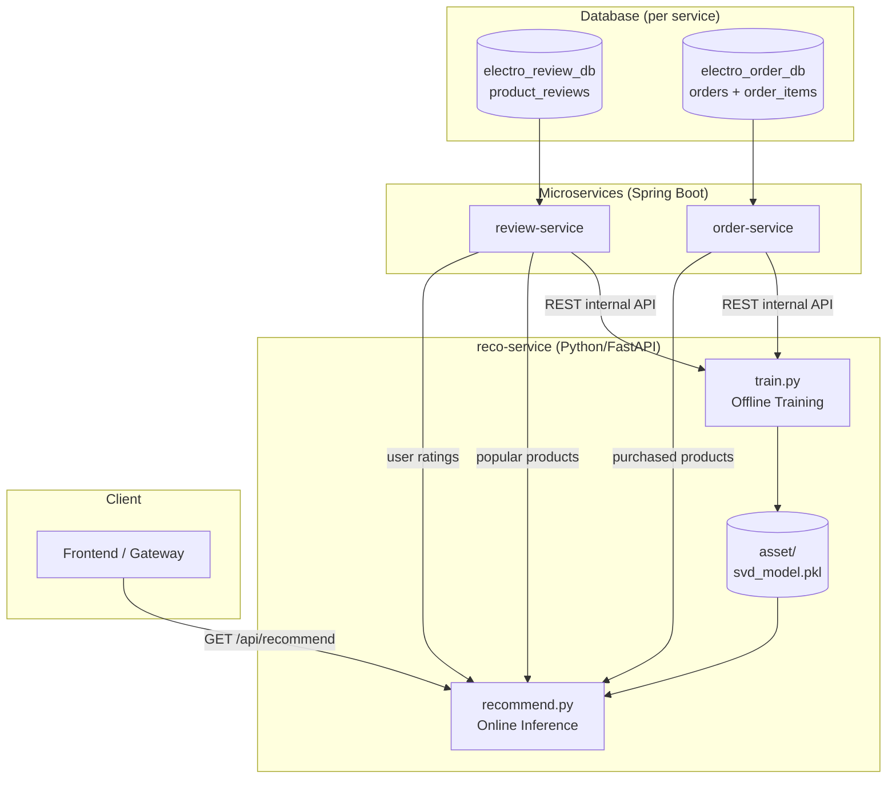
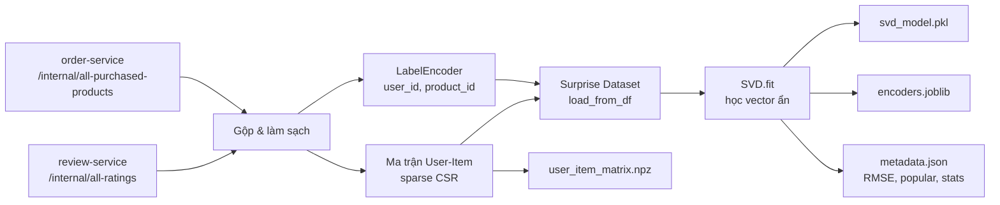
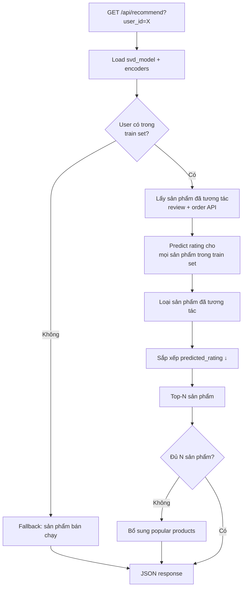

# Luồng Data Flow — reco-service (SVD Collaborative Filtering)

## 1. Tổng quan kiến trúc



---

## 2. Luồng Training (Offline)



### Chi tiết từng bước

| Bước | Module | Input | Output |
|------|--------|-------|--------|
| 1 | `service_client` | Eureka → review-service | `(userId, productId, rating)` đã duyệt |
| 2 | `service_client` | Eureka → order-service | `(userId, productId)` đã mua → rating=3.5 |
| 3 | `build_clean_dataframe` | reviews + purchases | DataFrame sạch, dedup, lọc user/product |
| 4 | `_encode_ids` | DataFrame | `u_enc`, `i_enc` (LabelEncoder) |
| 5 | `_build_user_item_matrix` | ratings encoded | Ma trận sparse `(n_users × n_products)` |
| 6 | `_train_svd_model` | Surprise Dataset | SVD model + RMSE/MAE (hold-out 20%) |
| 7 | `_serialize_artifacts` | model + encoders | Files trong `asset/` |

### Công thức SVD (đặc trưng ẩn)

```
predicted_rating(u, i) = μ + b_u + b_i + p_u · q_i^T
```

- `μ`: rating trung bình toàn hệ thống
- `b_u`, `b_i`: bias user và sản phẩm
- `p_u`, `q_i`: vector ẩn (50 chiều) — **User Vector** và **Item Vector**

---

## 3. Luồng Inference (Online)



### Cold-start handling

| Tình huống | Xử lý hiện tại | Tương lai |
|------------|----------------|-----------|
| User mới (chưa có trong train set) | Popular / best sellers | Content-based |
| Item mới (chưa có trong train set) | Không predict được → bổ sung popular | Content-based |
| User có ít tương tác | SVD vẫn predict từ vector ẩn | — |

---

## 4. Mapping dữ liệu Database → Training

| Nguồn DB | Bảng | API nội bộ | Cột train |
|----------|------|------------|-----------|
| `electro_review_db` | `product_reviews` | `GET /api/reviews/internal/all-ratings` | `user_id`, `product_id`, `rating` |
| `electro_order_db` | `orders` + `order_items` | `GET /api/orders/internal/all-purchased-products` | `user_id`, `product_id`, rating=3.5 |
| `electro_review_db` | aggregated | `GET /api/reviews/internal/popular-products` | `popular_products` (cold-start) |

---

## 5. Artifact sau Training

```
collaborativefiltering/asset/
├── svd_model.pkl           # Surprise SVD (predict)
├── user_encoder.joblib     # "10541" → 12
├── item_encoder.joblib     # "20015" → 45
├── user_item_matrix.npz    # Ma trận sparse (phân tích / báo cáo)
└── metadata.json           # version, stats, RMSE, popular_products
```

---

## 6. API Response mẫu

**User đã có trong train set (SVD):**

```json
{
  "user_id": "10541",
  "status": "success",
  "strategy": "SVD Latent Factors (user=10541, candidates=280)",
  "recommendations": [
    {"product_id": 20015, "predicted_rating": 4.72},
    {"product_id": 20088, "predicted_rating": 4.51}
  ]
}
```

**User mới (cold-start):**

```json
{
  "user_id": "99999",
  "status": "cold_start",
  "strategy": "Popular Products (cold-start: new user)",
  "recommendations": [
    {"product_id": 1001, "predicted_rating": 4.9}
  ]
}
```
